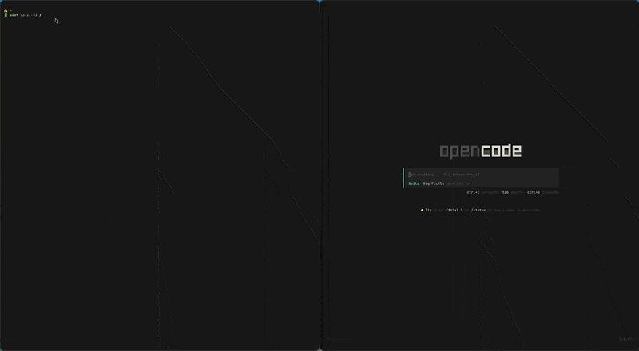

# ghostpencode

> Bi-directional theme sync between Ghostty terminal and OpenCode with image palette extraction

Extract color palettes from images or sync themes between Ghostty and OpenCode with automatic naming convention conversion and instant reload.



## Key Features

- **Image → Themes** - Extract palettes from any image using k-means clustering
- **Bi-directional Sync** - Ghostty ↔ OpenCode with automatic format conversion
- **Smart Naming** - Converts between "Title Case With Spaces" (Ghostty) and "kebab-case" (OpenCode)
- **Auto-Reload** - Ghostty reloads instantly via SIGUSR2 (no restart needed)
- **Zero Config** - Works out of the box, auto-installs OpenCode skill
- **Lightweight** - ~200 LOC, single dependency (sharp for image processing)

## Tech Stack

- **Runtime**: Bun 1.0+
- **Language**: TypeScript 5+
- **Image Processing**: sharp (libvips)
- **Testing**: Bun Test (65 tests, all passing)
- **Package Manager**: Bun

## Prerequisites

- **Bun** 1.0 or higher - [Install Bun](https://bun.sh)
- **Ghostty** terminal - [Install Ghostty](https://ghostty.org)
- **OpenCode** (optional) - For OpenCode sync features
- **macOS or Linux** - Windows support planned

## Installation

### Quick Install (Recommended)

**Option 1: Install from npm** (once published)
```bash
bun install -g ghostpencode
# or with npm
npm install -g ghostpencode
```

**Option 2: Install from GitHub** (current method)
```bash
# Clone and install globally
git clone https://github.com/jcbbge/ghostpencode.git
cd ghostpencode
bun install
bun link

# Verify installation
ghostpencode --help
```

**Option 3: Use npx/bunx** (no installation)
```bash
bunx ghostpencode --help
```

This automatically:
- Installs the CLI globally
- Registers the OpenCode skill at `~/.config/opencode/skill/theme-sync/`
- Makes `ghostpencode` available system-wide

```bash
ghostpencode --help
```

Expected output:
```
ghostpencode - Theme sync for Ghostty & OpenCode

Usage:
  ghostpencode                                      Check sync status
  ghostpencode sync --from <ghostty|opencode>       Manual sync
  ghostpencode detect                               Show current themes
  ghostpencode extract <image> [--name <name>]      Extract from image
```

### First Run

```bash
ghostpencode
```

Shows your current Ghostty and OpenCode themes and their sync status:
```
GHOSTTY :: Monokai Pro Light | OPENCODE :: monokai-pro-light [✓]
```

If they're out of sync, it prompts to sync automatically.

## Usage

### Check Sync Status (Interactive)

```bash
ghostpencode
```

**What it does:**
- Shows current Ghostty theme
- Shows current OpenCode theme
- Displays sync status (`[✓]` = synced, `[x]` = not synced)
- If not synced, prompts: "Sync? (y/n)"
- Pressing `y` syncs Ghostty → OpenCode automatically

**Example:**
```
GHOSTTY :: Nord | OPENCODE :: monokai-pro-light [x]

Sync? (y/n):
```

### Manual Sync

```bash
# Sync Ghostty theme to OpenCode
ghostpencode sync --from ghostty

# Sync OpenCode theme to Ghostty
ghostpencode sync --from opencode

# Sync specific theme (not currently active)
ghostpencode sync --from ghostty --theme "Dracula"
```

**What happens:**
1. Reads theme from source app
2. Converts naming convention automatically:
   - Ghostty: `"Monokai Pro Light"` → OpenCode: `"monokai-pro-light"`
   - OpenCode: `"catppuccin-mocha"` → Ghostty: `"Catppuccin Mocha"`
3. Writes theme to destination app
4. Updates config file
5. Reloads Ghostty (SIGUSR2 signal, instant, no UI flash)

**Output:**
```
Reading Ghostty theme: Monokai Pro Light
Syncing to OpenCode as: monokai-pro-light
✓ OpenCode theme written to ~/.config/opencode/themes/monokai-pro-light.json
✨ Synced "Monokai Pro Light" → "monokai-pro-light"!
```

### Extract Theme from Image

```bash
# Auto-names theme from filename
ghostpencode extract sunset.png

# Custom theme name
ghostpencode extract ~/Pictures/wallpaper.jpg --name ocean-vibes
```

**What it does:**
1. Loads image (PNG, JPG, WebP supported)
2. Resizes to 100×100 for performance
3. Applies k-means clustering to extract 16 dominant colors
4. Maps colors to ANSI palette (0-15) by hue and luminance
5. Creates theme in BOTH formats:
   - Ghostty: `~/.config/ghostty/themes/Ocean Vibes`
   - OpenCode: `~/.config/opencode/themes/ocean-vibes.json`
6. Activates the theme in both apps
7. Reloads Ghostty automatically

**Output:**
```
Extracting palette from ~/Pictures/wallpaper.jpg...
Creating Ghostty theme: Ocean Vibes
✓ Ghostty theme written to ~/.config/ghostty/themes/Ocean Vibes
Creating OpenCode theme: ocean-vibes
✓ OpenCode theme written to ~/.config/opencode/themes/ocean-vibes.json

✨ Theme "Ocean Vibes" / "ocean-vibes" created and activated!
```

### Detect Current Themes

```bash
ghostpencode detect
```

**Output:**
```
Current themes:
  Ghostty:  Monokai Pro Light
  OpenCode: monokai-pro-light

✓ Themes are in sync!
  (Ghostty: "Monokai Pro Light" ↔ OpenCode: "monokai-pro-light")
```

## How It Works

### Image Palette Extraction

1. **Load Image** - Uses sharp (libvips) for fast image processing
2. **Resize** - Downsample to 100×100 to reduce computation
3. **K-Means Clustering** - Extracts 16 dominant colors from pixel data
4. **ANSI Mapping** - Intelligently maps colors to ANSI 0-15:
   - Slot 0: Darkest (black)
   - Slots 1-6: Base colors sorted by hue
   - Slot 7: Light color (white)
   - Slots 8-14: Bright variants
   - Slot 15: Brightest (bright white)
5. **Theme Generation** - Creates structured theme files for both apps

### Theme Sync Architecture

```
┌─────────────────────────────────────────────────────────┐
│                    ghostpencode                         │
│                                                         │
│  ┌────────────┐         ┌─────────────┐         ┌──────┐│
│  │   Image    │────────▶│   Extract   │────────▶│Theme ││
│  │  (PNG/JPG) │         │  (K-means)  │         │Files ││
│  └────────────┘         └─────────────┘         └──────┘│
│                                                         │
│  ┌────────────┐         ┌─────────────┐         ┌──────┐│
│  │  Ghostty   │◀───────▶│    Sync     │◀───────▶│Open- ││
│  │   Theme    │ Title   │  Engine     │ kebab   │Code  ││
│  │"Nord Light"│ Case    │(Auto-reload)│ -case   │Theme ││
│  └────────────┘         └─────────────┘         └──────┘│
└─────────────────────────────────────────────────────────┘
```

### Naming Convention Conversion

ghostpencode automatically converts between formats:

| Ghostty (Title Case) | OpenCode (kebab-case) |
|----------------------|-----------------------|
| `Monokai Pro Light` | `monokai-pro-light` |
| `Nord` | `nord` |
| `Catppuccin Mocha` | `catppuccin-mocha` |
| `Rose Pine Moon` | `rose-pine-moon` |

**How it works:**
- **Ghostty → OpenCode**: Lowercases and replaces spaces with hyphens
- **OpenCode → Ghostty**: Title-cases words and replaces hyphens with spaces
- **Comparison**: Normalizes both (removes spaces/hyphens/case) to check if synced

## File Locations

```
Ghostty config:  ~/Library/Application Support/com.mitchellh.ghostty/config
                 (fallback: ~/.config/ghostty/config)

Ghostty themes:  ~/.config/ghostty/themes/ (user themes)
                 /Applications/Ghostty.app/Contents/Resources/ghostty/themes/ (built-in: 438 themes)

OpenCode config: ~/.config/opencode/opencode.json
OpenCode themes: ~/.config/opencode/themes/

OpenCode skill:  ~/.config/opencode/skill/theme-sync/ (auto-installed)
```

### Theme File Formats

**Ghostty Theme** (`~/.config/ghostty/themes/My Theme`):
```
# My Theme
# Generated by ghostpencode

palette = 0=#191919
palette = 1=#de6e7c
palette = 2=#7cde7c
palette = 3=#decb7c
palette = 4=#7c91de
palette = 5=#de7cde
palette = 6=#7cdede
palette = 7=#d4d4d4
palette = 8=#606060
palette = 9=#ff8888
palette = 10=#aacc88
palette = 11=#ffcc88
palette = 12=#88aaff
palette = 13=#ff88ff
palette = 14=#88ffff
palette = 15=#ffffff
background = #191919
foreground = #d4d4d4
cursor-color = #d4d4d4
cursor-text = #191919
selection-background = #404040
selection-foreground = #d4d4d4
```

**OpenCode Theme** (`~/.config/opencode/themes/my-theme.json`):
```json
{
  "$schema": "https://opencode.ai/theme.json",
  "defs": {
    "bg": "#191919",
    "fg": "#d4d4d4",
    "cursor": "#d4d4d4",
    "selection": "#404040",
    "black": "#191919",
    "red": "#de6e7c",
    "green": "#7cde7c",
    "orange": "#decb7c",
    "blue": "#7c91de",
    "magenta": "#de7cde",
    "cyan": "#7cdede",
    "white": "#d4d4d4",
    "brightBlack": "#606060",
    "brightRed": "#ff8888",
    "brightGreen": "#aacc88",
    "brightOrange": "#ffcc88",
    "brightBlue": "#88aaff",
    "brightMagenta": "#ff88ff",
    "brightCyan": "#88ffff",
    "brightWhite": "#ffffff"
  },
  "theme": { ... }
}
```

## Architecture

### Directory Structure

```
ghostpencode/
├── src/
│   ├── cli.ts              # CLI entry point, argument parsing
│   ├── extract.ts          # Image palette extraction (k-means)
│   ├── ghostty.ts          # Ghostty theme I/O operations
│   ├── opencode.ts         # OpenCode theme I/O operations
│   ├── sync.ts             # Theme sync logic, naming conversion
│   ├── types.ts            # TypeScript type definitions
│   ├── install-skill.ts    # OpenCode skill installer
│   └── watch.ts            # Interactive sync prompt
├── skill/
│   └── theme-sync/         # OpenCode skill definition
│       └── index.md        # Skill documentation
├── tests/
│   ├── unit/               # Unit tests (4 files)
│   │   ├── extract.test.ts
│   │   ├── ghostty.test.ts
│   │   ├── opencode.test.ts
│   │   └── sync.test.ts
│   └── integration/        # Integration tests (2 files)
│       ├── e2e.test.ts
│       └── cli.test.ts
├── package.json            # Bun package manifest
├── tsconfig.json           # TypeScript configuration
└── README.md               # This file
```

### Request Flow

**Sync Flow (Ghostty → OpenCode):**
```
1. User runs: ghostpencode sync --from ghostty
2. CLI parses args (src/cli.ts)
3. syncFromGhostty() called (src/sync.ts)
4. getCurrentGhosttyTheme() reads config (src/ghostty.ts)
5. readGhosttyTheme() loads palette (src/ghostty.ts)
6. toKebabCase() converts name (src/sync.ts)
7. writeOpenCodeTheme() writes JSON (src/opencode.ts)
8. writeOpenCodeConfig() updates config (src/opencode.ts)
9. Success message printed
```

**Extract Flow (Image → Themes):**
```
1. User runs: ghostpencode extract sunset.png
2. CLI parses args, extracts filename
3. extractFromImage() called (src/sync.ts)
4. extractPaletteFromImage() processes image (src/extract.ts)
   ├─▶ Load with sharp
   ├─▶ Resize to 100×100
   ├─▶ K-means clustering (16 colors)
   └─▶ Map to ANSI slots
5. toTitleCase() & toKebabCase() generate names
6. writeGhosttyTheme() creates Ghostty theme
7. writeOpenCodeTheme() creates OpenCode theme
8. Both themes activated in configs
9. Ghostty auto-reloads
```

## Available Scripts

| Command | Description |
|---------|-------------|
| `bun test` | Run full test suite (65 tests) |
| `bun test:unit` | Run unit tests only |
| `bun test:integration` | Run integration tests only |
| `bun test:watch` | Run tests in watch mode |
| `bun test:coverage` | Run tests with coverage report |

## Testing

### Running Tests

```bash
# Run all tests
bun test

# Run with coverage
bun test:coverage

# Watch mode (re-runs on file changes)
bun test:watch

# Run specific test file
bun test tests/unit/extract.test.ts

# Run tests matching pattern
bun test --grep "sync"
```

### Test Structure

```
tests/
├── unit/                   # Unit tests (4 files, 45 tests)
│   ├── extract.test.ts     # Image palette extraction
│   ├── ghostty.test.ts     # Ghostty I/O operations
│   ├── opencode.test.ts    # OpenCode I/O operations
│   └── sync.test.ts        # Sync logic and naming
└── integration/            # Integration tests (2 files, 20 tests)
    ├── e2e.test.ts         # End-to-end workflows
    └── cli.test.ts         # CLI argument parsing
```

### Test Coverage

```
File             | % Funcs | % Lines | Uncovered Line #s
-----------------|---------|---------|-------------------
src/extract.ts   | 84.62%  | 96.59%  | 70-72
src/ghostty.ts   | 80.00%  | 48.80%  | (edge cases)
src/opencode.ts  | 83.33%  | 75.00%  | (edge cases)
src/sync.ts      | 33.33%  | 25.64%  | (needs improvement)
-----------------|---------|---------|-------------------
Overall          | 70.32%  | 61.51%  |
```

**Status:** ✅ All 65 tests passing

See [TEST_REPORT.md](./TEST_REPORT.md) for detailed test analysis.

## OpenCode Integration

When installed, `ghostpencode` automatically registers a skill in OpenCode at `~/.config/opencode/skill/theme-sync/`.

This teaches the OpenCode AI assistant how to:
- Extract themes from images
- Sync themes between apps
- Understand naming conventions
- Help with theme troubleshooting

**Usage in OpenCode:**
```
"Extract a theme from this image" → Runs ghostpencode extract
"Sync my Ghostty and OpenCode themes" → Runs ghostpencode sync
"Make my terminal match OpenCode" → Runs ghostpencode sync --from opencode
```

The assistant knows what to do automatically.

## Troubleshooting

### Ghostty Theme Not Found

**Error:** `Could not read Ghostty theme: My Theme`

**Solution:**
1. Check if theme exists:
   ```bash
   ls ~/.config/ghostty/themes/
   ls /Applications/Ghostty.app/Contents/Resources/ghostty/themes/ | grep "My Theme"
   ```
2. Try with exact name (case-sensitive):
   ```bash
   ghostpencode sync --from ghostty --theme "Monokai Pro Light"
   ```

### OpenCode Config Not Found

**Error:** `Could not find OpenCode config`

**Solution:**
Create the config directory:
```bash
mkdir -p ~/.config/opencode
echo '{"theme": ""}' > ~/.config/opencode/opencode.json
```

### Image Extraction Fails

**Error:** `Could not read image`

**Solution:**
1. Check file exists and is readable:
   ```bash
   ls -la ~/Pictures/image.png
   ```
2. Verify format is supported (PNG, JPG, WebP):
   ```bash
   file ~/Pictures/image.png
   ```
3. Try with absolute path:
   ```bash
   ghostpencode extract "$HOME/Pictures/image.png"
   ```

### Ghostty Not Auto-Reloading

**Symptom:** Theme changes but Ghostty doesn't refresh

**Solution:**
1. Check if Ghostty is running:
   ```bash
   ps aux | grep Ghostty.app
   ```
2. Manually reload: Press `cmd+shift+,` (macOS)
3. Verify SIGUSR2 support (Ghostty 1.1.0+):
   ```bash
   ghostty --version
   ```

### Themes Not Syncing

**Error:** `Themes differ. Run sync to align them.`

**Solution:**
1. Check current themes:
   ```bash
   ghostpencode detect
   ```
2. Run sync in desired direction:
   ```bash
   ghostpencode sync --from ghostty  # Use Ghostty theme
   # OR
   ghostpencode sync --from opencode  # Use OpenCode theme
   ```

### Sharp/libvips Installation Issues

**Error:** `Cannot find module 'sharp'`

**Solution:**
1. Reinstall with native dependencies:
   ```bash
   bun install --force
   ```
2. On macOS, ensure Xcode Command Line Tools:
   ```bash
   xcode-select --install
   ```
3. On Linux, install libvips:
   ```bash
   # Ubuntu/Debian
   sudo apt-get install libvips-dev

   # Fedora/RHEL
   sudo dnf install vips-devel
   ```

## Development

### Local Setup

```bash
# Clone repository
git clone https://github.com/jcbbge/ghostpencode.git
cd ghostpencode

# Install dependencies
bun install

# Run tests
bun test

# Run CLI locally
bun run src/cli.ts --help

# Install globally for testing
bun link
ghostpencode --help
```

### Publishing to npm

To enable true one-click installation (`bun install -g ghostpencode`):

```bash
# 1. Login to npm
npm login

# 2. Update version in package.json
bun version patch  # or minor, major

# 3. Build and test
bun test

# 4. Publish
npm publish

# 5. Tag release on GitHub
git tag v$(node -p "require('./package.json').version")
git push --tags
```

After publishing, users can install with:
```bash
bun install -g ghostpencode
# or
npm install -g ghostpencode
# or
bunx ghostpencode --help  # no install needed
```

### Project Structure

- **src/cli.ts** - Entry point, handles argument parsing and command routing
- **src/extract.ts** - Image processing and color extraction via k-means
- **src/ghostty.ts** - Ghostty theme I/O (read/write themes and config)
- **src/opencode.ts** - OpenCode theme I/O (JSON format, config management)
- **src/sync.ts** - High-level sync operations and naming conversion
- **src/types.ts** - Shared TypeScript types (Palette interface)
- **src/watch.ts** - Interactive sync prompt (used by `ghostpencode` no-args)
- **src/install-skill.ts** - Installs OpenCode skill (runs on postinstall)

### Adding a New Feature

1. Add types to `src/types.ts` if needed
2. Implement logic in appropriate module (extract/ghostty/opencode/sync)
3. Add CLI command in `src/cli.ts`
4. Write unit tests in `tests/unit/`
5. Add integration test in `tests/integration/`
6. Update README
7. Run tests: `bun test`

## Contributing

Contributions welcome! This is a personal project but open to improvements.

**Areas needing work:**
- Increase sync.ts test coverage (currently 25.64%)
- Add Linux/Windows Ghostty reload support
- Improve color mapping algorithm
- Add theme preview/screenshot generation
- Support more image formats (AVIF, HEIF)

**Process:**
1. Fork the repository
2. Create a feature branch: `git checkout -b feature-name`
3. Make changes and add tests
4. Ensure tests pass: `bun test`
5. Commit: `git commit -m "feat: description"`
6. Push: `git push origin feature-name`
7. Open a Pull Request

## License

MIT License - See [LICENSE](./LICENSE)

---

# Addendum: Creating a Ghostty Theme Switcher Extension

This guide shows how to build your own Ghostty theme switcher (like `ghth`) as a personal extension.

## What You'll Build

A simple bash script that:
- Edits Ghostty config to change themes
- Reloads Ghostty automatically via SIGUSR2 signal
- Provides quick commands to list/set/view themes
- Integrates with your shell (zsh/bash)

**Result:** Type `ghth "Nord"` to instantly change your Ghostty theme.

## Prerequisites

- **macOS** (this guide is macOS-specific, Linux similar)
- **Ghostty** installed
- **Basic terminal knowledge**

## Step 1: Create the Script

Create a new file at `~/bin/ghth`:

```bash
mkdir -p ~/bin
touch ~/bin/ghth
chmod +x ~/bin/ghth
```

Open `~/bin/ghth` in your editor and paste:

```bash
#!/bin/bash

# Ghostty Theme Switcher
# Edits config file and reloads Ghostty via SIGUSR2

set -euo pipefail

# Color output
GREEN='\033[0;32m'
BLUE='\033[0;34m'
YELLOW='\033[1;33m'
NC='\033[0m'

# Config location (macOS default)
GHOSTTY_CONFIG="$HOME/Library/Application Support/com.mitchellh.ghostty/config"

function get_current_theme() {
    if [[ -f "$GHOSTTY_CONFIG" ]]; then
        grep '^theme[[:space:]]*=' "$GHOSTTY_CONFIG" 2>/dev/null | \
            sed 's/theme[[:space:]]*=[[:space:]]*//' | \
            tr -d '"' | tr -d "'"
    fi
}

function set_theme() {
    local theme_name="$1"

    if [[ -z "$theme_name" ]]; then
        echo -e "${RED}Error: Theme name required${NC}" >&2
        return 1
    fi

    # Title-case the theme name (Ghostty themes are title-cased with spaces, not hyphens)
    # First convert hyphens to spaces, then capitalize first letter of each word
    theme_name=$(echo "$theme_name" | tr '-' ' ' | awk '{for(i=1;i<=NF;i++) $i=toupper(substr($i,1,1)) tolower(substr($i,2));}1')

    # Update config
    if grep -q '^theme[[:space:]]*=' "$GHOSTTY_CONFIG" 2>/dev/null; then
        sed -i '' "s/^theme[[:space:]]*=.*/theme = $theme_name/" "$GHOSTTY_CONFIG"
    else
        echo -e "\ntheme = $theme_name" >> "$GHOSTTY_CONFIG"
    fi

    echo -e "${GREEN}✓${NC} Set theme: $theme_name"

    # Reload Ghostty
    local ghostty_pid=$(ps aux | grep "Ghostty.app" | grep -v grep | awk '{print $2}' | head -1)

    if [[ -n "$ghostty_pid" ]]; then
        kill -USR2 "$ghostty_pid" 2>/dev/null
        echo -e "${GREEN}✓${NC} Config reloaded (PID $ghostty_pid)"
    else
        echo -e "${YELLOW}⚠${NC} Ghostty not running"
    fi
}

function show_current() {
    local theme=$(get_current_theme)
    if [[ -n "$theme" ]]; then
        echo -e "${BLUE}Current theme:${NC} $theme"
    else
        echo "No theme set"
    fi
}

function list_themes() {
    echo "Built-in themes (438 total):"
    echo "Run: ghostty +list-themes"
    echo ""
    echo "Or pick from: Nord, Dracula, Monokai Pro Light, etc."
}

function show_help() {
    echo "Ghostty Theme Switcher"
    echo ""
    echo "Usage:"
    echo "  ghth <theme-name>      Set theme and reload"
    echo "  ghth --current         Show current theme"
    echo "  ghth --list            List available themes"
    echo "  ghth --help            Show this help"
    echo ""
    echo "Examples:"
    echo "  ghth Nord"
    echo "  ghth \"Monokai Pro Light\""
}

# Main
case "${1:-}" in
    --list | -l)
        list_themes
        ;;
    --current | -c)
        show_current
        ;;
    --help | -h | "")
        show_help
        ;;
    *)
        set_theme "$1"
        ;;
esac
```

## Step 2: Add to PATH

Ensure `~/bin` is in your PATH. Add to `~/.zshrc` or `~/.bashrc`:

```bash
# Add ~/bin to PATH
export PATH="$HOME/bin:$PATH"
```

Reload your shell:
```bash
source ~/.zshrc
```

## Step 3: Test It

```bash
# Show help
ghth

# Show current theme
ghth --current

# List available themes
ghth --list

# Set a theme (case doesn't matter - automatically title-cased, hyphens converted to spaces)
ghth "Nord"
ghth "dracula"           # Converts to "Dracula"
ghth "GRUVBOX"           # Converts to "Gruvbox"
ghth "catppuccin-mocha"  # Converts to "Catppuccin Mocha"
```

## Step 4: Add Shell Integration (Optional)

Create `~/.ghostty-theme-integration.zsh`:

```bash
# Ghostty Theme Switcher Shell Integration

# Helper function - show all Ghostty commands
function ghostty-help() {
    cat << 'EOF'
Ghostty Theme Switcher

Commands:
  ghth <theme>         Set theme
  ghth --current       Show current theme
  ghth --list          List available themes
  ghth --help          Show help

Examples:
  ghth "Monokai Pro Light"
  ghth Nord
  ghth --current
EOF
}
```

Add to `~/.zshrc`:
```bash
# Load Ghostty theme integration
if [ -f "$HOME/.ghostty-theme-integration.zsh" ]; then
    source "$HOME/.ghostty-theme-integration.zsh"
fi
```

## How It Works

### 1. Config File Editing

The script edits `~/Library/Application Support/com.mitchellh.ghostty/config`:

**Before:**
```
theme = Dracula
```

**Command:** `ghth Nord`

**After:**
```
theme = Nord
```

### 2. SIGUSR2 Reload Signal

Ghostty supports the SIGUSR2 signal for reloading config without restarting:

```bash
# Find Ghostty process ID
ps aux | grep Ghostty.app | grep -v grep | awk '{print $2}'

# Send reload signal
kill -USR2 <pid>
```

The script does this automatically after changing the theme.

### 3. Why ps + grep Instead of pgrep?

On macOS, `pgrep -x ghostty` doesn't find `Ghostty.app`. We use:
```bash
ps aux | grep "Ghostty.app" | grep -v grep | awk '{print $2}'
```

This reliably finds the Ghostty process.

## Customization Ideas

### Add Theme Favorites

```bash
function ghth-dark() {
    ghth "Catppuccin Mocha"
}

function ghth-light() {
    ghth "Catppuccin Latte"
}
```

### Theme Toggle

```bash
function ghth-toggle() {
    local current=$(ghth --current | grep -o '[^:]*$' | xargs)

    if [[ "$current" == "Nord" ]]; then
        ghth "Dracula"
    else
        ghth "Nord"
    fi
}
```

### Random Theme

```bash
function ghth-random() {
    local themes=("Nord" "Dracula" "Monokai Pro" "Catppuccin Mocha" "Rose Pine")
    local random_theme=${themes[$RANDOM % ${#themes[@]}]}
    ghth "$random_theme"
}
```

## Difference from ghostpencode

| Feature | ghostpencode | ghth (Your Extension) |
|---------|--------------|------------------------|
| **Purpose** | Sync themes between apps | Quick Ghostty theme switch |
| **Scope** | Ghostty + OpenCode | Ghostty only |
| **Image extraction** | ✅ Yes | ❌ No |
| **Theme sync** | ✅ Bi-directional | ❌ Not needed |
| **Naming conversion** | ✅ Automatic | ❌ Not needed |
| **Installation** | Global npm package | Local bash script |
| **Use case** | Theme management | Quick switching |

**Summary:** `ghostpencode` is for theme creation and syncing. `ghth` is for quickly changing Ghostty themes. They complement each other!

## Troubleshooting

### "Command not found: ghth"

**Solution:** Ensure `~/bin` is in PATH:
```bash
echo $PATH | grep "$HOME/bin"
# If not found:
export PATH="$HOME/bin:$PATH"
```

### "Permission denied"

**Solution:** Make script executable:
```bash
chmod +x ~/bin/ghth
```

### Theme changes but Ghostty doesn't reload

**Solution:**
1. Check Ghostty version (needs 1.1.0+ for SIGUSR2):
   ```bash
   ghostty --version
   ```
2. Manually reload: Press `cmd+shift+,`

### sed errors on macOS

**Solution:** macOS sed requires `-i ''` (empty string for in-place edit):
```bash
sed -i '' "s/pattern/replacement/" file
```

Already handled in the script!

## Next Steps

- Add tab completion for theme names
- Create theme preview screenshots
- Build a TUI (text UI) theme picker
- Integrate with other terminal apps
- Share your extension with others!

## Resources

- [Ghostty Documentation](https://ghostty.org/docs)
- [Ghostty Theme Gallery](https://ghostty.org/themes) (if available)
- [SIGUSR2 Signal Documentation](https://man7.org/linux/man-pages/man7/signal.7.html)

Happy theming! 🎨
